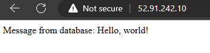

# Automating AWS Resource Deployment using CloudFormation

## Objective: 

*The goal of this AWS lab is to create a CloudFormation stack template to automates the deployment of a web application on AWS.*

## Instructions:

### 1. Create a CloudFormation template that accomplishes the following tasks:

    - Creates a Virtual Private Cloud (VPC) with 1 public subnet and and 2 private subnet.

    - Creates an Internet Gateway and attaches it to the VPC.

    - Configures the routing tables for the public and private subnets.

    - Creates a security group for an Amazon EC2 instance with rules allowing inbound HTTP and SSH traffic.

    - Launches an EC2 instance in the public subnet. 
  
    - The instance should run a web server and a python script to make a connection to the database (see the user data included below)

    - Creates a Multi AZ Amazon RDS database instance in the private subnet.

### 2. Use the following as the parameters for your CloudFormation template:

    - VPC CIDR block
    - Public subnet CIDR block
    - Private subnet CIDR block
    - EC2 instance type
    - RDS instance class
    - RDS database name, username, and password
    - Instance key pair name

### 3. The following user data can be included in the template (update values as necessary):

Link to [User Data](userdata.yml) 

This user data installs a web server and python dependencies and then runs a simple Flask application that connects to the RDS database, adds a record, and then retrieves the message from the database.

## Solution
   
**Complete Solution:**  [here](template.yml)

After deployment, the web application can be accessed at the public IP address of the EC2 instance. The public IP address can be found in the Outputs section of the CloudFormation stack.

## References: 

1. [EC2 Instance](https://docs.aws.amazon.com/AWSCloudFormation/latest/UserGuide/aws-properties-ec2-instance.html)
2. [AWS RDS Instance](https://docs.aws.amazon.com/AWSCloudFormation/latest/UserGuide/aws-resource-rds-dbinstance.html)
3. [AWS RDS DB Security Group](https://docs.aws.amazon.com/AWSCloudFormation/latest/UserGuide/aws-properties-rds-security-group.html)
4. [AWS RDS DB Subnet Group](https://docs.aws.amazon.com/AWSCloudFormation/latest/UserGuide/aws-resource-rds-dbsubnetgroup.html)
5. [FreeCloudLabs.com](https://medium.com/@freecloudlabs)

## FAQS: 
1. Why I need two subnets when I'm only launching single RDS intance? 

    When we create an RDS instance and we have to explicitly mention to create a Multi-AZ DB cluster. If we don't specify then by default it creates a single DB instance in 1 AZ.  But the catch is - AWS would need us to define at least two subnets in two different AZs even for a single DB instance. It's hard to notice how AWS creates a DB subnet group when we use a console because as soon as we choose a VPC, it automatically selects the subnets in two different AZs. But in the console, later it allows us to choose a preferred AZ for the DB instance and here we can choose the AZ where we have our private subnet. Similarly, in CloudFormation, we can specify the AZ for the DB instance to launch it in the private subnet. So, it's possible to launch an RDS DB instance in a private subnet in a VPC where we only have 1 private and 1 public subnet.

    I think AWS is forcing this at the time of the creation of a single DB instance so that in the future if the customer wants to create a standby instance using Multi-AZ deployment then they don't have to launch a new Multi-AZ deployment. Finally, I can stop and move away from this. It was hurting as I was not getting why they asked for two AZ for a single instance.