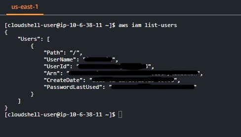
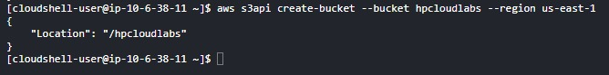
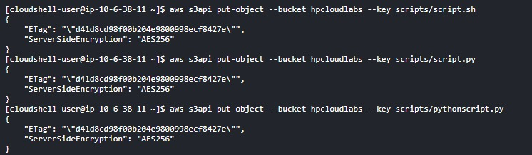
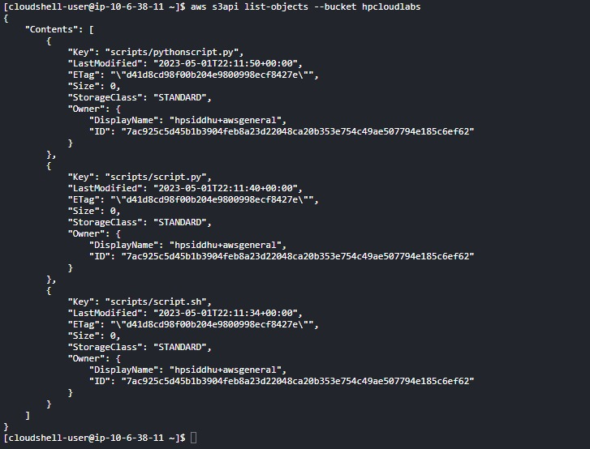
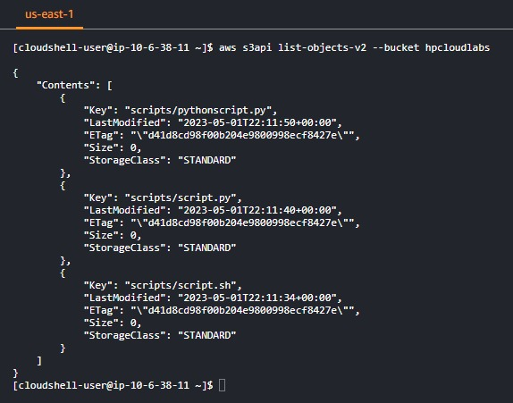
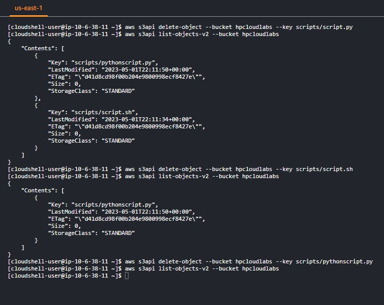
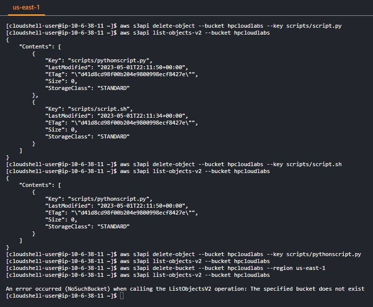

**List IAM Users in Account**
- `aws iam list-users`
  

**Create S3 Bucket**
- `aws s3api create-bucket --bucket hpcloudlabs --region us-east-1`
  

**Put objects in Bucket**
- `aws s3api put-object --bucket hpcloudlabs --key scripts/script.sh`
- `aws s3api put-object --bucket hpcloudlabs --key scripts/pythonscript.py`
- `aws s3api put-object --bucket hpcloudlabs --key scripts/script.py`

 

**List object**
- `aws s3api list-objects --bucket hpcloudlabs`
  
  

**List object V2 From Bucket**
- `aws s3api list-objects-v2 --bucket hpcloudlabs`

  

**Get Object From Bucket**
- `aws s3api get-object --bucket hpcloudlabs --key script/script.py scriptcopy.p`

**Delete Object From Bucket**
- `aws s3api delete-object --bucket hpcloudlabs --key scripts/script.py`

 

**Delete Bucket**
- `aws s3api delete-bucket --bucket hpcloudlabs --region us-east-1`

